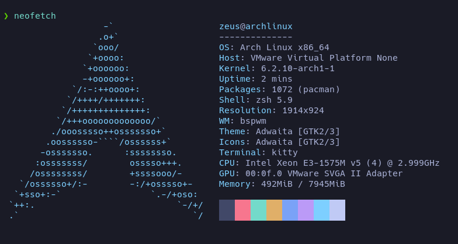

# Resumen de scripts para instalación de Arch Linux

Repositorio de Scripts para Instalación de Arch Linux
Este repositorio contiene una serie de scripts útiles para la instalación y configuración de Arch Linux. A continuación, se describe brevemente cada uno de ellos.
Es necesario contar con el medio de instalacion oficial de ArchLinux, pudiendo emplear el primer sctipt para su intalacion, realizar esta de forma manual o bien empleando archinstall.

{: width="400" height="300"}

## Requisitos mínimos para instalar Arch Linux con los scripts presentados

- Una computadora con arquitectura de 64 bits.
- Al menos 2 GB de memoria RAM (se recomienda 6 GB o más para un rendimiento óptimo).
- Al menos 10 GB de espacio libre en el disco duro (Recomendado 100 GB).
- Una conexión a internet estable.
- Conocimientos básicos de línea de comandos y particionamiento de discos.
- Los scripts presentados en este repositorio.
- Un medio de instalación de Arch Linux (como un USB o un CD).

### La presente configuracion esta testeada en maquina virtual con VmWare

### Neofetch
La imagen muestra una captura de pantalla de Neofetch, un comando de línea de terminal que muestra información del sistema, como la distribución de Linux, la versión del kernel, el hardware, la memoria y más.
{: width="400" height="300"}

## Visualizacion de recursos consumidos empleando Btop y Htop para recuperar esta informacion
{: width="400" height="300"}
{: width="400" height="300"}

## Script 1: install_SistemaBaseArchLinux.sh
Este script se encarga de la instalación del sistema base de Arch Linux. Primero, verifica que el sistema esté conectado a internet y, a continuación, actualiza los repositorios e instala los paquetes necesarios para realizar la instalación. Luego, crea las particiones necesarias en el disco duro y formatea las mismas con el sistema de archivos elegido por el usuario. Por último, instala el bootloader GRUB y reinicia el sistema.

## Script 2: Install_EntornoArchLinux.sh
Este script instala los paquetes necesarios para crear un entorno de escritorio básico en Arch Linux. Incluye la instalación de Xorg, el servidor de gráficos, así como también de un entorno de escritorio como XFCE. También instala otros paquetes útiles como un navegador web, un editor de texto y una herramienta de compresión de archivos.

## Script 3: install_WebDev.sh
Este script se encarga de la instalación de paquetes necesarios para el desarrollo web en Arch Linux. Instala un servidor web (Apache), así como también paquetes de desarrollo web como PHP, Node.js y Composer. Además, instala herramientas para el desarrollo de bases de datos como MySQL y DBeaver. Por último, agrega la ruta global de Composer al PATH y habilita los servicios necesarios.

## Modo de instalacion
# Descarga e instala el script install_SistemaBaseArchLinux.sh
curl -sSfL https://raw.githubusercontent.com/Black-Zeus/Entornos/main/install_SistemaBaseArchLinux.sh | bash -

# Descarga e instala el script Install_EntornoArchLinux.sh
curl -sSfL https://raw.githubusercontent.com/Black-Zeus/Entornos/main/Install_EntornoArchLinux.sh | bash -

# Descarga e instala el script install_WebDev.sh
curl -sSfL https://raw.githubusercontent.com/Black-Zeus/Entornos/main/install_WebDev.sh | bash -

### Nota de reconocimiento

La presentación del entorno utiliza herramientas como Polybar, bspwm, rofi, sxhkd, y se ha basado en los tutoriales presentados por S4vitar en su canal de YouTube. 
Queremos agradecer y reconocer el excelente trabajo de S4vitar en la comunidad de CyberSeguridad en Español, sus tutoriales de introduccion a Linux, preparacion de ambientes (Parrot OS / ArchLinux) han sido de gran ayuda para la creación de este entorno.

Si deseas conocer más sobre el trabajo de S4vitar, te invitamos a visitar su canal de YouTube en el siguiente enlace: [https://www.youtube.com/@s4vitar](https://www.youtube.com/@s4vitar)
